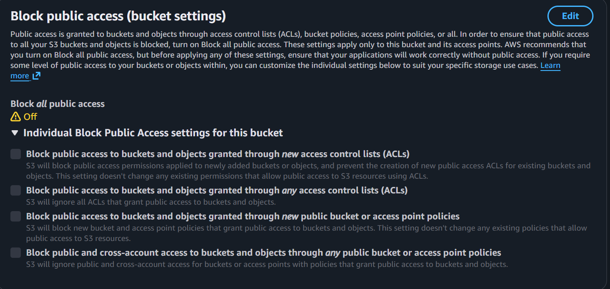

# ⚡ Rewiring Aotearoa Electrification Progress Tracker

A data engineering project for tracking electrification progress in Aotearoa New Zealand using electricity market data by:
- Ingesting raw data from multiple energy sources (EMI, EECA, GIC)
- Processing and transforming data through layered architecture
- Serving analytics via REST API with DuckDB querying
- Visualizing data in interactive dashboards

## 💡 Key Features

### Summary
- **Layered Data Architecture**: Raw → Processed → Metrics data flow
- **Split ETL Pipelines**: Separate extract and transform steps
- **DuckDB Backend**: Efficient querying with repository pattern
- **Multiple Data Sources**: EMI Generation, EECA Energy, GIC Gas
- **REST API**: FastAPI backend with filtering and query support
- **Dual Dashboards**: Streamlit and Shiny for Python options
- **Type Safety**: Pydantic validation throughout
- **Code Quality**: Pre-commit hooks with Ruff

### [Three-Layer Data Architecture](docs/ARCHITECTURE.md)
Data is extracted, processed, and stored in multiple forms (see link above for more information):
1. **Raw Layer** (`data/raw/`): Original data exactly as received from APIs
2. **Processed Layer** (`data/processed/`): Cleaned, validated, standardized data
3. **Metrics Layer** (`data/metrics/`): Business-ready analytics and aggregations

### [ETL Pipeline](docs/ETL_GUIDE.md)
Each data source has separate scripts (see link above for more information):
- **`extract.py`**: Fetch raw data from API → save to `data/raw/`
- **`transform.py`**: Read raw data → clean/transform → save to `data/processed/`
- **`analytics.py`**: Read processed data → aggregate/analyze → save to `data/metrics/`

### Backend
- **DuckDB Repository Pattern**: Efficient SQL querying of CSV data
- **RESTful API**: FastAPI endpoints for both processed and metrics layers
- **Query Support**: Filter by date ranges, columns, with pagination
- **Decoupled Design**: Frontend only communicates through API


## 📋 Prerequisites

- **uv** - Fast Python package manager ([install guide](https://docs.astral.sh/uv/))

### Installing uv

**Windows (PowerShell):**
```powershell
powershell -c "irm https://astral.sh/uv/install.ps1 | iex"
```

**macOS/Linux:**
```bash
curl -LsSf https://astral.sh/uv/install.sh | sh
```

## 🚀 Quick Start

### 1. Clone and Setup

**Windows:**
```powershell
git clone https://github.com/good-data-institute/rewiring-aotearoa-electrification-progress-tracker.git
cd rewiring-aotearoa-electrification-progress-tracker
uv venv --python 3.12
.venv/Scripts/Activate.ps1
uv sync
pre-commit install
Copy-Item .env.example .env
```

**macOS/Linux:**
```bash
git clone https://github.com/good-data-institute/rewiring-aotearoa-electrification-progress-tracker.git
cd rewiring-aotearoa-electrification-progress-tracker
uv venv --python 3.12
source .venv/bin/activate
uv sync
pre-commit install
cp .env.example .env
```

### 2. Run ETL Pipelines

#### Option 1: Run [run_all_pipelines.py](etl/run_all_pipelines.py)

```bash
python -m etl.run_all_pipelines
```

#### Option 2: Run each pipeline separately

**Extract raw data:**
```bash
python -m etl.pipelines.eeca.extract
python -m etl.pipelines.gic.extract
python -m etl.pipelines.emi_generation.extract
```

**Transform to processed:**
```bash
python -m etl.pipelines.eeca.transform
python -m etl.pipelines.gic.transform
python -m etl.pipelines.emi_generation.transform
```

**Create metrics/analytics:**
```bash
python -m etl.pipelines._01_P1_EV
# Add other analytics as needed
```

### 3. Run Backend and Frontend

**Terminal 1 - Backend:**
```bash
python -m backend.main
```

**Terminal 2 - Dashboard:**
```bash
streamlit run frontend/Introduction.py
shiny run frontend/shiny_app.py --port 8502 # only for demonstration purposes
```

### 4. Verify Setup
```bash
python ./scripts/verify_setup.py
```

Fix anything that comes up after the script runs, if needed.

### 5. Celebrate 🎉

The following URLs should work now:

- Backend API: http://localhost:8000
- API Docs: http://localhost:8000/docs
- Streamlit: http://localhost:8501
- Shiny: http://localhost:8502

### 6. Access the dashboard online

As of December 2025, the Streamlit dashboard is deployed into a staging environment on Render and is accessible at https://electrification-dashboard-udy4.onrender.com.

When accessing the dashboard for the first time, click 'Refresh All Data' to populate the dashboard with the latest set of metrics and metadata.

## 🔧 Development

I want to:

### Fix or update my uv environment
```bash
uv add package-name             # Add dependency to pyproject.toml
uv add --dev package-name       # Add dev dependency to pyproject.toml
uv remove package-name          # Remove dependency from pyproject.toml
uv sync --upgrade               # Install/update dependencies in your virtual environment
uv pip list                     # List packages
```

### Resolve code quality issues

You can run the following commands:
```bash
ruff check --fix .        # Lint and fix
ruff format .             # Format code
pre-commit run --all-files # Run all checks
```

Or if you're using Visual Studio Code, then after you try to commit then Ruff should automatically apply the fixes in additional commits that you can also add to your commit. If Ruff keeps failing even after this, check the exact error message and make the necessary changes manually (it may be something Ruff can't automatically fix) or ignore the error in a specific file by commenting at the top of the file:
```python
# ruff: noqa: {error code from the error message}
```

### Deploy the dashboard onto Render and AWS
1. Create an AWS bucket and upload the data folder (which should have been created locally upon running [run_all_pipelines.py](etl/run_all_pipelines.py))
- In [render.yaml](render.yaml), update the S3 bucket URL
- In the bucket permissions, make the bucket public:

- ⚠️ This should NOT be done when actually making this dashboard and/or the data in the bucket publicly visible! Only the application requesting the data should have permissions to read the bucket (see [Future Improvements](https://github.com/good-data-institute/rewiring-aotearoa-electrification-progress-tracker?tab=readme-ov-file#-future-improvements))

2. The dashboard itself is already deployed to Render into via [this blueprint](render.yaml) in the metrics-dashboard project, so you should see the latest changes upon every push to main
- If you don't, log into RA's Render dashboard via the credentials RA provided to GDI in Slack and manually deploy from there: https://dashboard.render.com/web/srv-d4cqf2ali9vc73c5gpag 
- The link above is also where you can debug any deployment/networking issues by looking at the logs on the right-hand side

### Change something in the data pipelines at any stage

1. Make the change as usual via a PR
2. Run [run_all_pipelines.py](etl/run_all_pipelines.py) (or just the part/s that you updated and any processing/metrics that depend on it)
3. Copy over the data directory into the same location as all your other data in AWS

This is intentionally done as a manual step to avoid overcomplicating things at this stage (see [Future Improvements](https://github.com/good-data-institute/rewiring-aotearoa-electrification-progress-tracker?tab=readme-ov-file#-future-improvements))

### See my latest changes in the dashboard

In its current form, there are several places in this repository where information is hard-coded. Thankfully, it's all in one repository.

#### Data-related changes
Click any of the refresh buttons on the dashboard to fetch the latest data from S3
- Note that you won't see any data-related changes if you haven't run the ETL code you've changed and uploaded that data to AWS first
- Also, you may need to update the file mappings in [repository.py](backend/repository.py) to see any new/renamed data

#### Metadata-related changes
Update one or more of the files depending on what exactly you want to do:
- [metadata.py](backend/metadata.py)
- [mappings.py](etl/core/mappings.py)
- [dashboard_utils.py](frontend/dashboard_utils.py)

Then go through the usual process (PR into main, deploy into Render, refresh the data)

## 🔮 Future Improvements

- Creating a GitHub Action to run all ETL and upload to S3
- Using a Render-native service for storing data
- Using local data during development rather than reading from S3
- Using Terraform to deploy the dashboard as a multi-cloud application
- Adding IAM/RBAC for reading and writing data
