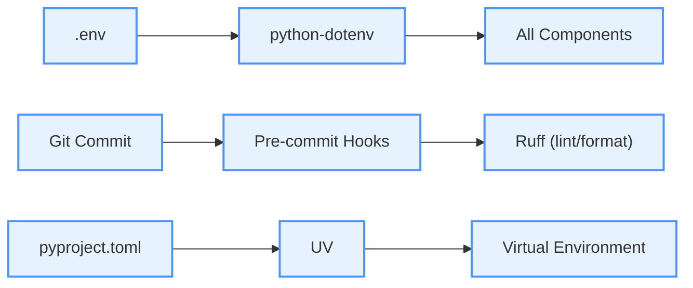
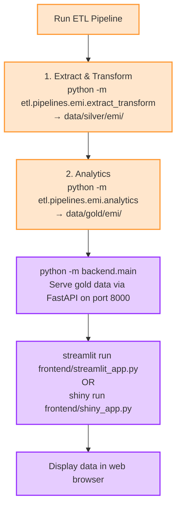

# System Architecture

This document describes the system design, data flow, and technical architecture.

## Data Flow Visualization

```mermaid
flowchart TB
    subgraph "Silver Layer (Data)"
        API["External API<br/>(EMI Retail)"]
        APIClient["API Client<br/>(EMIRetailAPI)<br/><br/>etl/apis/emi_retail.py<br/>Validates: report_id,<br/>Capacity, DateFrom, etc."]
        ExtractTransform["Extract & Transform<br/><br/>etl/pipelines/emi/extract_transform.py<br/>- Fetch from API<br/>- Clean data<br/>- Remove duplicates<br/>- Standardize columns"]
        Silver["Silver Layer<br/>(Clean Data)<br/><br/>data/silver/emi/*.csv"]

        API -->|"HTTPS GET Request<br/>(Pydantic-validated params)"| APIClient
        APIClient -->|"Raw CSV Data"| ExtractTransform
        ExtractTransform -->|"Pandas + DuckDB<br/>Transformations"| Silver
    end

    subgraph "Gold Layer (Analytics)"
        Silver2["Silver Layer"]
        Business["Business Logic<br/><br/>etl/pipelines/emi/analytics.py<br/>- Aggregations<br/>- Calculated fields<br/>- DuckDB SQL queries<br/>- Pandas transforms"]
        Gold["Gold Layer<br/>(Analytics)<br/><br/>data/gold/emi/*.csv"]

        Silver2 -->|"Read CSV"| Business
        Business -->|"Analytics-Ready CSV"| Gold
    end

    subgraph "API SERVING - Backend"
        Gold2["Gold Layer"]
        FastAPI["FastAPI Backend<br/><br/>backend/main.py<br/>Endpoints:<br/>- GET /<br/>- GET /health<br/>- GET /api/emi-retail<br/>"]
        HTTP["HTTP Response<br/>(JSON)<br/><br/>localhost:8000"]

        Gold2 -->|"Read CSV"| FastAPI
        FastAPI -->|"JSON Response"| HTTP
    end

    subgraph "VISUALIZATION - Frontend"
        Backend["FastAPI Backend"]
        Streamlit["Streamlit<br/>Dashboard<br/>:8501"]
        Shiny["Shiny<br/>Dashboard<br/>:8502"]
        Browser["User's Web Browser<br/>- Data tables<br/>- CSV downloads<br/>- Interactive controls"]

        Backend -->|"HTTP GET"| Streamlit
        Backend -->|"HTTP GET"| Shiny
        Streamlit -->|"Renders"| Browser
        Shiny -->|"Renders"| Browser
    end

    Silver --> Silver2
    Gold --> Gold2
    HTTP --> Backend

    classDef silverStyle color:#000000,fill:#c0c0c0,stroke:#808080,stroke-width:2px
    classDef goldStyle color:#000000,fill:#ffd700,stroke:#b8860b,stroke-width:2px
    classDef backendStyle color:#000000,fill:#87ceeb,stroke:#4682b4,stroke-width:2px
    classDef frontendStyle color:#000000,fill:#98fb98,stroke:#228b22,stroke-width:2px

    class API,APIClient,ExtractTransform,Silver,Silver2 silverStyle
    class Business,Gold,Gold2 goldStyle
    class FastAPI,HTTP,Backend backendStyle
    class Streamlit,Shiny,Browser frontendStyle
```

## Key Technologies at Each Stage

**Silver (Extract & Transform):**
- requests (HTTP client)
- Pydantic (parameter validation)
- Pandas (data cleaning)
- DuckDB (SQL transformations)
- CSV (file format)

**Gold (Analytics):**
- Pandas (transformations)
- DuckDB (SQL aggregations)
- CSV (file format)

**Backend:**
- FastAPI (REST API)
- Uvicorn (ASGI server)
- Pandas (data reading)

**Frontend:**
- Streamlit (dashboard)
- Shiny (alternative dashboard)
- requests (HTTP client)

## Configuration & Quality

## Execution Sequence

## Technology Stack by Layer

**Silver (Extract & Transform):**
- HTTP Client: `requests`
- Validation: `Pydantic`
- Data Processing: `Pandas`, `DuckDB`
- Storage: CSV files

**Gold (Analytics):**
- Data Processing: `Pandas`, `DuckDB`
- Storage: CSV files

**Backend:**
- API Framework: `FastAPI`
- Server: `Uvicorn` (ASGI)
- Data Reading: `Pandas`

**Frontend:**
- Dashboards: `Streamlit`, `Shiny for Python`
- HTTP Client: `requests`

**Configuration & Quality:**
- Settings: `Pydantic Settings`, `python-dotenv`
- Code Quality: `Ruff`, `Pre-commit`
- Package Manager: `uv`

## Configuration Flow

## Extensibility

### Adding New Data Source

1. **API Client**: Create `etl/apis/<source>.py`
   - Inherit from `BaseAPIClient`
   - Define Pydantic parameter model

2. **Pipelines**: Create `etl/pipelines/<source>/`
   - `extract_transform.py` → Silver layer (cleaning)
   - `analytics.py` → Gold layer (aggregations)

3. **Backend**: Add endpoint in `backend/main.py`
   - Read gold CSV
   - Serve as JSON

4. **Frontend**: Update dashboards
   - Add visualizations in `frontend/streamlit_app.py`
   - Add visualizations in `frontend/shiny_app.py`

### Customizing Processing

- **Silver Layer**: Override `DataLayer.process()` for extract & transform
- **Gold Layer**: Override `AnalyticsLayer.process()` for analytics
- **SQL Queries**: Add custom DuckDB queries for SQL-based transformations
- **Business Logic**: Implement in analytics layer with Pandas
