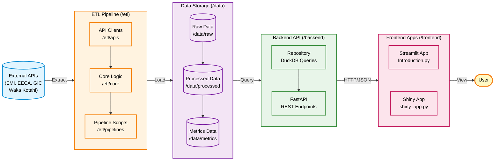
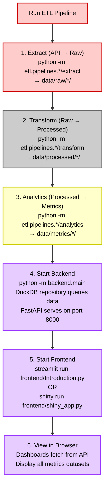

# System Architecture

This document describes the system design, data flow, and technical architecture for the Rewiring Aotearoa Electrification Progress Tracker.

## High-Level System Overview



## Detailed Data Flow Visualization

```mermaid
flowchart TB
    subgraph "Raw Layer (Extraction)"
        API["External API<br/>(EMI, EECA, GIC<br/>Waka Kotahi)"]
        APIClient["API Client<br/>(Pydantic-validated)"]
        Extract["Extract Script<br/><br/>etl/pipelines/*/extract.py<br/>- Fetch from API<br/>- Save raw data<br/>- No transformation"]
        Raw["Raw Layer<br/>(Original Data)<br/><br/>data/raw/*/*.csv/xlsx"]

        API -->|"HTTPS GET Request"| APIClient
        APIClient -->|"Raw Data"| Extract
        Extract -->|"Save as-is"| Raw
    end

    subgraph "Processed Layer (Transformation)"
        Raw2["Raw Layer"]
        Transform["Transform Script<br/><br/>etl/pipelines/*/transform.py<br/>- Read raw data<br/>- Clean & validate<br/>- Standardize columns<br/>- Remove duplicates"]
        Processed["Processed Layer<br/>(Clean Data)<br/><br/>data/processed/*/*.csv"]

        Raw2 -->|"Read Raw"| Transform
        Transform -->|"Pandas + DuckDB"| Processed
    end

    subgraph "Metrics Layer (Analytics)"
        Processed2["Processed Layer"]
        Analytics["Analytics Script<br/><br/>etl/pipelines/*/analytics.py<br/>- Aggregations<br/>- Business metrics<br/>- DuckDB SQL queries<br/>- Pandas transforms"]
        Metrics["Metrics Layer<br/>(Analytics)<br/><br/>data/metrics/*/*.csv"]

        Processed2 -->|"Read Processed"| Analytics
        Analytics -->|"Business-Ready"| Metrics
    end

    subgraph "Backend (API Layer)"
        DataLayers["Data Layers<br/>(Processed + Metrics)"]
        Repository["DuckDB Repository<br/><br/>backend/repository.py<br/>- Query with filters<br/>- Date range support<br/>- Pagination"]
        FastAPI["FastAPI Backend<br/><br/>backend/main.py<br/>Endpoints:<br/>- /api/datasets<br/>- /api/processed/{dataset}<br/>- /api/metrics/{dataset}"]
        HTTP["HTTP Response<br/>(JSON)<br/><br/>localhost:8000"]

        DataLayers -->|"DuckDB Queries"| Repository
        Repository -->|"DataFrame"| FastAPI
        FastAPI -->|"JSON Response"| HTTP
    end

    subgraph "Frontend (Dashboards)"
        Backend["Backend API"]
        Streamlit["Streamlit<br/>Dashboard<br/>:8501<br/>- All datasets<br/>- Simple tables"]
        Shiny["Shiny<br/>Dashboard<br/>:8502<br/>- All datasets<br/>- Simple tables"]
        Browser["User's Browser"]

        Backend -->|"HTTP GET /api/metrics/*"| Streamlit
        Backend -->|"HTTP GET /api/metrics/*"| Shiny
        Streamlit -->|"Renders"| Browser
        Shiny -->|"Renders"| Browser
    end

    Raw --> Raw2
    Processed --> Processed2
    Metrics --> DataLayers
    Processed --> DataLayers
    HTTP --> Backend

    classDef RawStyle color:#000000,fill:#ffcccc,stroke:#cc0000,stroke-width:2px
    classDef ProcessedStyle color:#000000,fill:#c0c0c0,stroke:#808080,stroke-width:2px
    classDef MetricsStyle color:#000000,fill:#ffd700,stroke:#b8860b,stroke-width:2px
    classDef backendStyle color:#000000,fill:#87ceeb,stroke:#4682b4,stroke-width:2px
    classDef frontendStyle color:#000000,fill:#98fb98,stroke:#228b22,stroke-width:2px

    class API,APIClient,Extract,Raw,Raw2 RawStyle
    class Transform,Processed,Processed2 ProcessedStyle
    class Analytics,Metrics,DataLayers MetricsStyle
    class Repository,FastAPI,HTTP,Backend backendStyle
    class Streamlit,Shiny,Browser frontendStyle
```



## Key Technologies

**Raw Layer (Extraction):**
- requests (HTTP client)
- Pydantic (parameter validation)
- CSV/Excel (file formats)
- No transformation logic

**Processed Layer (Transformation):**
- Pandas (data cleaning)
- DuckDB (SQL transformations)
- CSV (file format)

**Metrics Layer (Analytics):**
- Pandas (transformations)
- DuckDB (SQL aggregations)
- CSV (file format)

**Backend (API):**
- FastAPI (REST API)
- DuckDB (query engine)
- Repository pattern (data access)
- Uvicorn (ASGI server)

**Frontend (Dashboards):**
- Streamlit (interactive dashboard)
- Shiny for Python (alternative dashboard)
- requests (HTTP client)
- API-first architecture

## Configuration & Quality


## Execution Sequence



## Extensibility

### Adding New Data Source

1. **API Client**: Create `etl/apis/<source>.py`
   - Inherit from `BaseAPIClient`
   - Define Pydantic parameter model

2. **Pipelines**: Create `etl/pipelines/<source>/`
   - `extract.py` → Raw layer (API to raw storage)
   - `transform.py` → Processed layer (cleaning & transformation)
   - `analytics.py` → Metrics layer (aggregations & business logic)

3. **Backend**: Update `backend/repository.py`
   - Add file mapping in `file_mapping` dictionaries
   - DuckDB will automatically query the new CSV files

4. **Frontend**: No changes needed!
   - Dashboards automatically discover and display all datasets via `/api/datasets` endpoint

### Customizing Processing

- **Raw Layer**: Implement extractor class with `extract()` method to save raw data
- **Processed Layer**: Override `ProcessedLayer.process()` for transform logic
- **Metrics Layer**: Override `MetricsLayer.process()` for analytics
- **Backend Queries**: Add custom filters in repository pattern
- **SQL Queries**: Add custom DuckDB queries for SQL-based transformations
- **Business Logic**: Implement in analytics layer with Pandas or DuckDB SQL

### API Filtering Examples

```bash
# Get metrics with date filter
curl "http://localhost:8000/api/metrics/demo_emi_retail?filter_json={\"Year\":{\"gte\":2020,\"lte\":2025}}"

# Get processed data with pagination
curl "http://localhost:8000/api/processed/eeca?limit=50&offset=100"

# List all available datasets
curl "http://localhost:8000/api/datasets?layer=metrics"
```
