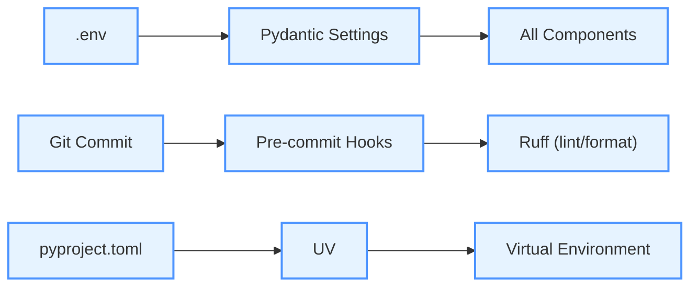
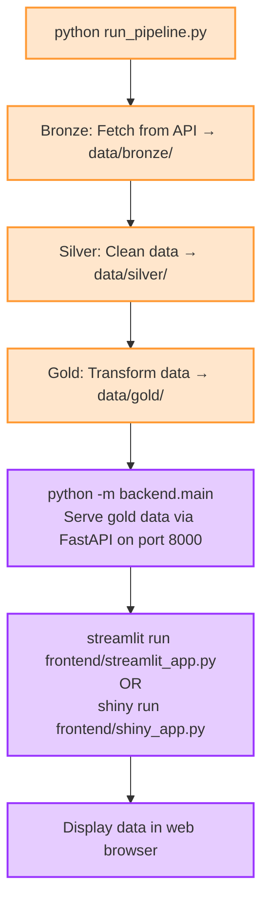

# Data Flow Visualization

This document shows the complete data flow through the system.

## Data Flow Architecture

```mermaid
flowchart TB
    subgraph "Bronze Layer"
        API["External API<br/>(EMI Retail)"]
        APIClient["API Client<br/>(EMIRetailAPI)<br/><br/>etl/apis/emi_retail.py<br/>Validates: report_id,<br/>Capacity, DateFrom, etc."]
        Bronze["Bronze Layer<br/>(Raw Storage)<br/><br/>data/bronze/emi_retail/*.csv<br/>etl/pipelines/bronze_emi_retail.py"]

        API -->|"HTTPS GET Request<br/>(Pydantic-validated params)"| APIClient
        APIClient -->|"Raw CSV Data"| Bronze
    end

    subgraph "Silver Layer"
        Bronze2["Bronze Layer"]
        Pandas["Pandas DataFrame<br/>- Remove duplicates<br/>- Standardize columns<br/>- Handle missing data"]
        DuckDB["DuckDB In-Memory<br/>- Data quality checks<br/>- SQL-based validation"]
        Silver["Silver Layer<br/>(Clean Data)<br/><br/>data/silver/emi_retail/*.csv<br/>etl/pipelines/silver_emi_retail.py"]

        Bronze2 -->|"Read CSV"| Pandas
        Pandas -->|"DuckDB Validation"| DuckDB
        DuckDB -->|"Cleaned CSV"| Silver
    end

    subgraph "Gold Layer"
        Silver2["Silver Layer"]
        Business["Business Logic<br/>- Aggregations<br/>- Calculated fields<br/>- DuckDB SQL queries<br/>- Pandas transforms"]
        Gold["Gold Layer<br/>(Analytics)<br/><br/>data/gold/emi_retail/*.csv<br/>etl/pipelines/gold_emi_retail.py"]

        Silver2 -->|"Read CSV"| Business
        Business -->|"Analytics-Ready CSV"| Gold
    end

    subgraph "API SERVING - Backend"
        Gold2["Gold Layer"]
        FastAPI["FastAPI Backend<br/><br/>backend/main.py<br/>Endpoints:<br/>- GET /<br/>- GET /health<br/>- GET /api/emi-retail<br/>- GET /api/.../summary"]
        HTTP["HTTP Response<br/>(JSON)<br/><br/>localhost:8000"]

        Gold2 -->|"Read CSV"| FastAPI
        FastAPI -->|"JSON Response"| HTTP
    end

    subgraph "VISUALIZATION - Frontend"
        Backend["FastAPI Backend"]
        Streamlit["Streamlit<br/>Dashboard<br/>:8501"]
        Shiny["Shiny<br/>Dashboard<br/>:8502"]
        Browser["User's Web Browser<br/>- Data tables<br/>- Summary stats<br/>- CSV downloads<br/>- Interactive controls"]

        Backend -->|"HTTP GET"| Streamlit
        Backend -->|"HTTP GET"| Shiny
        Streamlit -->|"Renders"| Browser
        Shiny -->|"Renders"| Browser
    end

    Bronze --> Bronze2
    Silver --> Silver2
    Gold --> Gold2
    HTTP --> Backend

    classDef bronzeStyle color:#000000,fill:#f4a460,stroke:#8b4513,stroke-width:2px
    classDef silverStyle color:#000000,fill:#c0c0c0,stroke:#808080,stroke-width:2px
    classDef goldStyle color:#000000,fill:#ffd700,stroke:#b8860b,stroke-width:2px
    classDef backendStyle color:#000000,fill:#87ceeb,stroke:#4682b4,stroke-width:2px
    classDef frontendStyle color:#000000,fill:#98fb98,stroke:#228b22,stroke-width:2px

    class API,APIClient,Bronze,Bronze2 bronzeStyle
    class Pandas,DuckDB,Silver,Silver2 silverStyle
    class Business,Gold,Gold2 goldStyle
    class FastAPI,HTTP,Backend backendStyle
    class Streamlit,Shiny,Browser frontendStyle
```

## Key Technologies at Each Stage

**Bronze:**
- requests (HTTP client)
- Pydantic (parameter validation)
- CSV (file format)

**Silver:**
- Pandas (data cleaning)
- DuckDB (SQL validation)
- CSV (file format)

**Gold:**
- Pandas (transformations)
- DuckDB (SQL aggregations)
- CSV (file format)

**Backend:**
- FastAPI (REST API)
- Uvicorn (ASGI server)
- Pandas (data reading)

**Frontend:**
- Streamlit (dashboard)
- Shiny (alternative dashboard)
- requests (HTTP client)

## Configuration & Quality

## Execution Sequence

## Extensibility Points

**Add New Data Source:**
1. `etl/apis/new_source.py` (API client + Pydantic model)
2. `etl/pipelines/bronze_new_source.py` (ingestion)
3. `etl/pipelines/silver_new_source.py` (cleaning)
4. `etl/pipelines/gold_new_source.py` (transformation)
5. `backend/main.py` (add endpoint)
6. `frontend/*.py` (update dashboards)

**Customize Processing:**
- Override MedallionLayer.process() methods
- Add custom DuckDB queries
- Implement business logic in gold layer
- Add Pandas transformations
