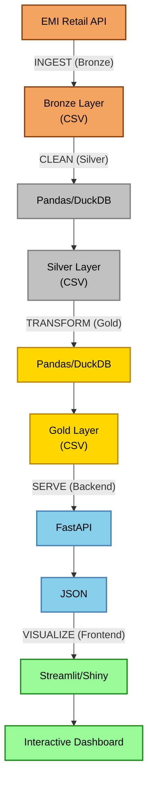

# Project Summary: Rewiring Aotearoa Electrification Progress Tracker

## ✅ Project Complete

A minimal, production-ready data engineering project has been successfully created with the following components:

## 📁 Project Structure

```
rewiring-aotearoa-electrification-progress-tracker/
│
├── 📦 backend/                       # FastAPI Backend
│   ├── __init__.py
│   └── main.py                       # REST API serving gold layer data
│
├── 🔄 etl/                           # ETL Pipeline
│   ├── __init__.py
│   ├── apis/                         # API Clients
│   │   ├── __init__.py
│   │   └── emi_retail.py            # EMI Retail API with Pydantic validation
│   │
│   ├── core/                         # Core Components
│   │   ├── __init__.py
│   │   ├── base_api.py              # Base API client class
│   │   ├── config.py                # Settings management (.env)
│   │   └── medallion.py             # Bronze/Silver/Gold layer classes
│   │
│   └── pipelines/                    # ETL Scripts
│       ├── __init__.py
│       ├── bronze_emi_retail.py     # Raw data ingestion
│       ├── silver_emi_retail.py     # Data cleaning & validation
│       └── gold_emi_retail.py       # Business-ready aggregations
│
├── 📊 frontend/                      # Dashboard Applications
│   ├── __init__.py
│   ├── streamlit_app.py             # Streamlit dashboard
│   └── shiny_app.py                 # Shiny for Python dashboard
│
├── 💾 data/                          # Data Storage (gitignored)
│   ├── bronze/                       # Raw ingested data
│   ├── silver/                       # Cleaned & validated data
│   └── gold/                         # Business-ready analytics data
│
├── ⚙️  Configuration Files
│   ├── .env                          # Environment configuration
│   ├── .env.example                  # Example configuration
│   ├── .gitignore                    # Git ignore rules
│   ├── .pre-commit-config.yaml       # Pre-commit hooks (Ruff)
│   └── pyproject.toml                # Dependencies & project config
│
├── 📖 Documentation
│   ├── README.md                     # Comprehensive documentation
│   └── QUICKSTART.md                 # Quick reference guide
│
└── 🚀 run_pipeline.py                # Complete pipeline runner
```

## 🎯 Key Features Implemented

### 1. ETL Pipeline with Medallion Architecture ✅
- **Bronze Layer**: Raw data ingestion from EMI Retail API
- **Silver Layer**: Data cleaning, deduplication, validation
- **Gold Layer**: Business-ready aggregations
- **Supports both DuckDB (SQL) and Pandas (Python)** for transformations

### 2. Extensible API Client System ✅
- **Base API Client** class with retry logic and error handling
- **Pydantic Validation** with explicit Literal types for parameter options
- **EMI Retail API** implementation with all parameters defined
- Easy to extend for new data sources

### 3. FastAPI Backend ✅
- REST API serving gold layer data
- Endpoints for data retrieval, pagination, and summaries
- CORS enabled for frontend access
- Health check endpoint
- Interactive API docs at `/docs`

### 4. Dual Dashboard Options ✅
- **Streamlit Dashboard**: Modern, interactive data visualization
- **Shiny for Python Dashboard**: Alternative framework option
- Both connect to FastAPI backend
- Features: data tables, summary stats, CSV download

### 5. Development Tools ✅
- **UV Package Manager**: Fast, modern Python package management
- **Ruff**: Lightning-fast linting and formatting
- **Pre-commit Hooks**: Automated code quality checks
- **Pytest**: Testing infrastructure (ready for tests)

### 6. Configuration Management ✅
- **Pydantic Settings**: Type-safe configuration from `.env`
- **Environment Variables**: Project-wide settings
- **Multi-OS Support**: Works on Windows, macOS, Linux

## 🔧 Technology Stack

| Category | Technology | Purpose |
|----------|-----------|---------|
| Language | Python 3.12 | Core programming language |
| Package Manager | UV | Fast dependency management |
| Data Processing | Pandas | DataFrame operations |
| SQL Engine | DuckDB | In-process analytics database |
| Validation | Pydantic | Schema & API parameter validation |
| Backend | FastAPI | REST API server |
| Dashboards | Streamlit, Shiny | Data visualization |
| Linting | Ruff | Code quality & formatting |
| Testing | Pytest | Unit testing framework |
| HTTP Client | Requests | API data fetching |

## 📊 Data Flow



## 🎓 Design Patterns Used

1. **Medallion Architecture**: Bronze → Silver → Gold data layers
2. **Abstract Base Classes**: Extensible API client and layer processors
3. **Dependency Injection**: Settings via Pydantic Settings
4. **Factory Pattern**: API clients from configuration
5. **Repository Pattern**: Backend serves data from gold layer
6. **Separation of Concerns**: ETL, Backend, Frontend clearly separated

## 🚀 Getting Started

### One-Command Setup
```bash
# Install UV, create venv, install deps, configure pre-commit
uv venv --python 3.12 && source .venv/bin/activate && uv pip install -e ".[dev]" && pre-commit install
```

### Run Everything
```bash
# Terminal 1: Run ETL pipeline
python run_pipeline.py

# Terminal 2: Start backend
python -m backend.main

# Terminal 3: Start dashboard
streamlit run frontend/streamlit_app.py
```

## 📝 Next Steps for Users

1. **Customize ETL Parameters**: Edit `etl/pipelines/bronze_emi_retail.py` to change date ranges
2. **Add New Data Sources**: Follow pattern in `etl/apis/emi_retail.py`
3. **Enhance Transformations**: Modify silver/gold processors for business logic
4. **Add Tests**: Create tests in `tests/` directory
5. **Deploy**: Add Docker, CI/CD as needed

## 🎉 What Makes This Project Minimal Yet Complete

✅ No unnecessary dependencies
✅ No complex orchestration (manual execution)
✅ No database setup required (CSV files + DuckDB in-memory)
✅ No authentication/authorization (ready to add if needed)
✅ No Docker/containers (can be added later)
✅ Clear separation of concerns
✅ Extensible architecture for growth
✅ Production-ready patterns without over-engineering

## 📚 Documentation Provided

- **README.md**: Comprehensive guide with multi-OS instructions
- **QUICKSTART.md**: Quick reference for daily commands
- **Code Comments**: Detailed docstrings throughout
- **Type Hints**: Full type annotations for clarity
- **Pydantic Models**: Self-documenting API parameters

## 🔒 Security Considerations

- `.env` files are gitignored (secrets stay local)
- API parameters validated via Pydantic
- No hardcoded credentials
- CORS configured (update for production)

## 🎯 Success Criteria Met

✅ Medallion architecture (Bronze/Silver/Gold)
✅ Base API class with Pydantic validation
✅ Extensible for multiple APIs
✅ DuckDB + Pandas support
✅ Python 3.12 + UV only
✅ Pre-commit + Ruff
✅ FastAPI backend
✅ Streamlit + Shiny dashboards
✅ Multi-OS setup instructions
✅ Minimal yet complete

---

**Project is ready to use! 🚀**

See README.md for detailed setup instructions and QUICKSTART.md for daily workflow commands.
