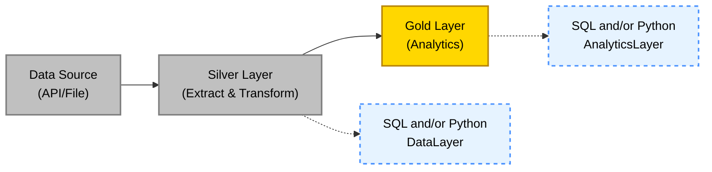

# ETL Development Guide

A comprehensive guide for building ETL pipelines using **DuckDB SQL** and **Pandas Python** in a 2-layer architecture.

## 📋 Table of Contents

- [Philosophy](#-philosophy)
- [Architecture Overview](#-architecture-overview)
- [Quick Start](#-quick-start)
- [ETL Approaches](#-etl-approaches)
- [Common Patterns](#-common-patterns)
- [SQL Query Examples](#-sql-query-examples)
- [Best Practices](#-best-practices)
- [Performance Tips](#-performance-tips)
- [DuckDB Features](#-duckdb-features)

---

## 🎯 Philosophy

This project uses a **2-layer architecture** with both SQL and Python for ETL transformations:

- **Silver Layer (Data)**: Extract from sources + Transform/Clean → `DataLayer`
- **Gold Layer (Analytics)**: Business-ready aggregations and metrics → `AnalyticsLayer`
- **Use SQL (DuckDB)** for: Set-based operations, aggregations, joins, filtering
- **Use Python (Pandas)** for: Complex business logic, API calls, iterative processing
- **Mix both**: Start with SQL for data shaping, then use Pandas for final touches

---

## 📊 Architecture Overview



### Data Layers

- **Silver (Data)**: Extract from source API/files + Clean/Transform (single step)
- **Gold (Analytics)**: Business-ready analytics and aggregations

---

## 🚀 Quick Start

### Basic Structure

```python
from etl.core.medallion import GoldLayer, SilverLayer
from pathlib import Path

class MyProcessor(GoldLayer):
    def process(self, input_path: Path, output_path: Path):
        # Your transformation logic here
        pass
```

### Execute SQL Query

```python
# In any processor class
df = self.execute_query("SELECT * FROM read_csv_auto('file.csv')")
```

### Read and Write CSV

```python
# Read using Pandas
df = self.read_csv(Path('data/file.csv'))

# Write to CSV
self.write_csv(df, Path('data/output.csv'))
```

---

## 🔧 ETL Approaches

### Option 1: Pure SQL Approach

**When to use:** Heavy aggregations, joins, filtering on large datasets

```python
from etl.core.medallion import GoldLayer
from pathlib import Path

class SQLProcessor(GoldLayer):
    def process(self, input_path: Path, output_path: Path):
        # Define transformation entirely in SQL
        query = f"""
        SELECT
            region,
            DATE_TRUNC('month', date_col) as month,
            SUM(value) as total,
            AVG(value) as average,
            COUNT(*) as record_count
        FROM read_csv_auto('{input_path}')
        WHERE date_col >= '2020-01-01'
        GROUP BY region, DATE_TRUNC('month', date_col)
        ORDER BY month DESC
        """

        # Execute and save
        df = self.execute_query(query)
        self.write_csv(df, output_path)
```

### Option 2: Pure Python Approach

**When to use:** Complex business logic, API calls, custom calculations

```python
from etl.core.medallion import GoldLayer
from pathlib import Path
import pandas as pd

class PandasProcessor(GoldLayer):
    def process(self, input_path: Path, output_path: Path):
        # Read with Pandas
        df = self.read_csv(input_path)

        # Transform with Pandas
        df['date_col'] = pd.to_datetime(df['date_col'])
        df = df[df['date_col'] >= '2020-01-01']

        df['month'] = df['date_col'].dt.to_period('M')
        result = df.groupby(['region', 'month']).agg({
            'value': ['sum', 'mean', 'count']
        }).reset_index()

        # Save
        self.write_csv(result, output_path)
```

### Option 3: Hybrid Approach (Recommended)

**When to use:** Most real-world scenarios

```python
from etl.core.medallion import GoldLayer
from pathlib import Path
import pandas as pd

class HybridProcessor(GoldLayer):
    def process(self, input_path: Path, output_path: Path):
        # Use SQL for heavy lifting
        query = f"""
        SELECT
            region,
            DATE_TRUNC('month', date_col) as month,
            SUM(value) as total_value,
            COUNT(*) as record_count
        FROM read_csv_auto('{input_path}')
        WHERE value IS NOT NULL
        GROUP BY region, DATE_TRUNC('month', date_col)
        """

        df = self.execute_query(query)

        # Use Pandas for business logic
        df['avg_per_record'] = df['total_value'] / df['record_count']
        df['category'] = df['total_value'].apply(
            lambda x: 'High' if x > 1000 else 'Low'
        )
        df['processed_at'] = pd.Timestamp.now()

        self.write_csv(df, output_path)
```

---

## 📚 Common Patterns

### Pattern 1: Deduplication (Silver Layer)

```python
class DeduplicationProcessor(SilverLayer):
    def process(self, input_path: Path, output_path: Path):
        # SQL approach - keep latest record per ID
        query = f"""
        SELECT DISTINCT ON (id)
            *
        FROM read_csv_auto('{input_path}')
        ORDER BY id, timestamp DESC
        """

        df = self.execute_query(query)
        self.write_csv(df, output_path)
```

### Pattern 2: Time Series Aggregation (Gold Layer)

```python
class TimeSeriesProcessor(GoldLayer):
    def process(self, input_path: Path, output_path: Path):
        query = f"""
        SELECT
            DATE_TRUNC('day', timestamp) as date,
            region,
            SUM(consumption) as daily_consumption,
            AVG(consumption) as avg_consumption,
            MAX(consumption) as peak_consumption,
            LAG(SUM(consumption)) OVER (
                PARTITION BY region
                ORDER BY DATE_TRUNC('day', timestamp)
            ) as prev_day_consumption
        FROM read_csv_auto('{input_path}')
        GROUP BY date, region
        ORDER BY date DESC, region
        """

        df = self.execute_query(query)

        # Calculate day-over-day change
        df['consumption_change'] = df['daily_consumption'] - df['prev_day_consumption']
        df['change_pct'] = (df['consumption_change'] / df['prev_day_consumption'] * 100).round(2)

        self.write_csv(df, output_path)
```

### Pattern 3: Multi-File Join (Gold Layer)

```python
class JoinProcessor(GoldLayer):
    def process(self, input_path: Path, output_path: Path):
        # Assume we have multiple files in silver layer
        silver_dir = input_path.parent

        query = f"""
        SELECT
            c.date,
            c.region,
            c.consumption,
            p.price,
            c.consumption * p.price as cost,
            w.temperature,
            w.weather_type
        FROM read_csv_auto('{silver_dir}/consumption.csv') c
        LEFT JOIN read_csv_auto('{silver_dir}/prices.csv') p
            ON c.date = p.date AND c.region = p.region
        LEFT JOIN read_csv_auto('{silver_dir}/weather.csv') w
            ON c.date = w.date AND c.region = w.region
        WHERE c.date >= '2020-01-01'
        """

        df = self.execute_query(query)

        # Add business categories
        df['cost_category'] = pd.cut(
            df['cost'],
            bins=[0, 100, 500, float('inf')],
            labels=['Low', 'Medium', 'High']
        )

        self.write_csv(df, output_path)
```

### Pattern 4: Data Quality Checks (Silver Layer)

```python
class QualityCheckProcessor(SilverLayer):
    def process(self, input_path: Path, output_path: Path):
        # SQL-based quality checks
        quality_query = f"""
        SELECT
            'Total Records' as check_name,
            COUNT(*) as check_value
        FROM read_csv_auto('{input_path}')

        UNION ALL

        SELECT
            'Null Values in Key Column',
            COUNT(*)
        FROM read_csv_auto('{input_path}')
        WHERE key_column IS NULL

        UNION ALL

        SELECT
            'Future Dates',
            COUNT(*)
        FROM read_csv_auto('{input_path}')
        WHERE date_column > CURRENT_DATE

        UNION ALL

        SELECT
            'Duplicate Rows',
            COUNT(*) - COUNT(DISTINCT *)
        FROM read_csv_auto('{input_path}')
        """

        quality_results = self.execute_query(quality_query)
        print("\nData Quality Report:")
        print(quality_results)

        # Pandas cleaning
        df = self.read_csv(input_path)
        df = df.dropna(subset=['key_column'])
        df = df[df['date_column'] <= pd.Timestamp.now()]

        self.write_csv(df, output_path)
```

---

## 🔍 SQL Query Examples

### Basic Queries

#### Read CSV with Auto Schema Detection

```sql
SELECT *
FROM read_csv_auto('data/bronze/file.csv')
LIMIT 10;
```

#### Filter Rows

```sql
SELECT *
FROM read_csv_auto('data/bronze/file.csv')
WHERE date_column >= '2020-01-01'
  AND value > 100
ORDER BY date_column DESC;
```

#### Select and Rename Columns

```sql
SELECT
    date_column as reporting_date,
    region_name as region,
    value as consumption_kwh
FROM read_csv_auto('data/bronze/file.csv');
```

### Aggregations

#### Group By with Multiple Aggregates

```sql
SELECT
    region,
    DATE_TRUNC('month', date_column) as month,
    SUM(value) as total_value,
    AVG(value) as avg_value,
    MIN(value) as min_value,
    MAX(value) as max_value,
    COUNT(*) as record_count
FROM read_csv_auto('data/silver/file.csv')
GROUP BY region, DATE_TRUNC('month', date_column)
ORDER BY month DESC, region;
```

#### Window Functions

```sql
SELECT
    date_column,
    region,
    value,
    SUM(value) OVER (
        PARTITION BY region
        ORDER BY date_column
    ) as running_total,
    AVG(value) OVER (
        PARTITION BY region
        ORDER BY date_column
        ROWS BETWEEN 6 PRECEDING AND CURRENT ROW
    ) as moving_avg_7day,
    RANK() OVER (
        PARTITION BY region
        ORDER BY value DESC
    ) as value_rank
FROM read_csv_auto('data/silver/file.csv')
ORDER BY region, date_column;
```

### Data Quality

#### Comprehensive Quality Check

```sql
SELECT
    'Total Rows' as metric,
    COUNT(*) as value
FROM read_csv_auto('data/bronze/file.csv')

UNION ALL

SELECT
    'Unique Rows',
    COUNT(DISTINCT *)
FROM read_csv_auto('data/bronze/file.csv')

UNION ALL

SELECT
    'Null Values',
    SUM(CASE WHEN value IS NULL THEN 1 ELSE 0 END)
FROM read_csv_auto('data/bronze/file.csv')

UNION ALL

SELECT
    'Duplicate Rows',
    COUNT(*) - COUNT(DISTINCT *)
FROM read_csv_auto('data/bronze/file.csv');
```

#### Column Profiling

```sql
SELECT
    'column_name' as column_name,
    COUNT(*) as total_count,
    COUNT(column_name) as non_null_count,
    COUNT(*) - COUNT(column_name) as null_count,
    MIN(column_name) as min_value,
    MAX(column_name) as max_value,
    AVG(column_name) as avg_value,
    STDDEV(column_name) as std_dev,
    PERCENTILE_CONT(0.25) WITHIN GROUP (ORDER BY column_name) as q1,
    PERCENTILE_CONT(0.50) WITHIN GROUP (ORDER BY column_name) as median,
    PERCENTILE_CONT(0.75) WITHIN GROUP (ORDER BY column_name) as q3
FROM read_csv_auto('data/silver/file.csv');
```

### Joins

#### Join Multiple CSV Files

```sql
SELECT
    a.date_column,
    a.region,
    a.consumption,
    b.price,
    a.consumption * b.price as total_cost
FROM read_csv_auto('data/silver/consumption.csv') a
LEFT JOIN read_csv_auto('data/silver/prices.csv') b
    ON a.date_column = b.date_column
    AND a.region = b.region;
```

### Time Series Operations

#### Time Series Analysis with Date Functions

```sql
SELECT
    date_column,
    YEAR(date_column) as year,
    MONTH(date_column) as month,
    DAYOFWEEK(date_column) as day_of_week,
    value,
    LAG(value, 1) OVER (ORDER BY date_column) as prev_day_value,
    value - LAG(value, 1) OVER (ORDER BY date_column) as day_over_day_change,
    (value - LAG(value, 1) OVER (ORDER BY date_column)) /
        LAG(value, 1) OVER (ORDER BY date_column) * 100 as pct_change
FROM read_csv_auto('data/silver/file.csv')
WHERE date_column >= CURRENT_DATE - INTERVAL '90 days'
ORDER BY date_column;
```

#### Pivot Data

```sql
PIVOT read_csv_auto('data/silver/file.csv')
ON region
USING SUM(value) as total_value
GROUP BY date_column
ORDER BY date_column;
```

### Deduplication

#### Remove Duplicates (Keep Most Recent)

```sql
SELECT DISTINCT ON (id_column)
    *
FROM read_csv_auto('data/bronze/file.csv')
ORDER BY id_column, date_column DESC;
```

### Conditional Logic

#### CASE Statements

```sql
SELECT
    date_column,
    region,
    value,
    CASE
        WHEN value < 100 THEN 'Low'
        WHEN value < 500 THEN 'Medium'
        ELSE 'High'
    END as value_category,
    CASE
        WHEN DAYOFWEEK(date_column) IN (6, 7) THEN 'Weekend'
        ELSE 'Weekday'
    END as day_type
FROM read_csv_auto('data/silver/file.csv');
```

### Export Results

#### Save Query Results to CSV

```sql
COPY (
    SELECT
        region,
        SUM(value) as total_value
    FROM read_csv_auto('data/silver/file.csv')
    GROUP BY region
) TO 'data/gold/aggregated.csv' (HEADER, DELIMITER ',');
```

---

## 🎓 Best Practices

### When to Use SQL (DuckDB)

✅ **Good for:**
- Filtering large datasets
- Aggregations (SUM, AVG, COUNT, etc.)
- Window functions (LAG, LEAD, ROW_NUMBER)
- Joins across multiple files
- GROUP BY operations
- Set operations (UNION, INTERSECT)

```python
# Good: SQL for aggregation
query = """
SELECT region, SUM(value) as total
FROM read_csv_auto('data.csv')
GROUP BY region
"""
df = self.execute_query(query)
```

### When to Use Python (Pandas)

✅ **Good for:**
- Complex conditional logic
- API calls per row
- Custom calculations
- String manipulation requiring regex
- Date parsing with custom formats
- ML model predictions
- Business rules requiring loops

```python
# Good: Pandas for complex logic
df['category'] = df.apply(
    lambda row: calculate_complex_category(row),
    axis=1
)
```

### Combining Both

✅ **Best practice:**

```python
# 1. Use SQL to reduce data size
query = """
SELECT * FROM read_csv_auto('big_file.csv')
WHERE date >= '2020-01-01'
AND region IN ('Auckland', 'Wellington')
"""
df = self.execute_query(query)

# 2. Use Pandas for business logic
df['custom_metric'] = df.apply(custom_calculation, axis=1)

# 3. Use SQL again for final aggregation if needed
temp_path = output_path.parent / 'temp.csv'
self.write_csv(df, temp_path)

final_query = f"""
SELECT region, AVG(custom_metric) as avg_metric
FROM read_csv_auto('{temp_path}')
GROUP BY region
"""
final_df = self.execute_query(final_query)
```

---

## 🎯 Performance Tips

1. **Filter early**: Use SQL WHERE clauses to reduce data before Pandas
2. **Use SQL for joins**: DuckDB is optimized for joining large datasets
3. **Aggregate in SQL**: GROUP BY is faster in SQL than Pandas
4. **Use Pandas for row-wise ops**: When you need to apply custom functions per row
5. **Temp files are OK**: Don't hesitate to write intermediate results
6. **Pattern matching**: Use `read_csv_auto('data/*.csv')` to read multiple files efficiently
7. **Column selection**: Only SELECT columns you need to reduce memory usage

---

## 🔌 DuckDB Features

### File Formats

```sql
-- CSV
read_csv_auto('file.csv')

-- Parquet
read_parquet('file.parquet')

-- JSON
read_json_auto('file.json')
```

### Pattern Matching

```sql
-- All CSV files in directory
read_csv_auto('data/*.csv')

-- Recursive search
read_csv_auto('data/**/*.csv')
```

### Date/Time Functions

```sql
-- Truncate to time unit
DATE_TRUNC('month', date_col)
DATE_TRUNC('day', timestamp_col)

-- Extract components
EXTRACT(YEAR FROM date_col)
EXTRACT(MONTH FROM date_col)

-- Current date/time
CURRENT_DATE
CURRENT_TIMESTAMP

-- Date arithmetic
date_col + INTERVAL '7 days'
date_col - INTERVAL '1 month'
```

### String Functions

```sql
-- Case conversion
UPPER(column), LOWER(column)

-- Trimming
TRIM(column), LTRIM(column), RTRIM(column)

-- Manipulation
SUBSTRING(column, start, length)
REPLACE(column, 'old', 'new')
CONCAT(col1, ' ', col2)

-- Aggregation
STRING_AGG(column, ', ')
```

### Window Functions

```sql
-- Ranking
ROW_NUMBER() OVER (...)
RANK() OVER (...)
DENSE_RANK() OVER (...)

-- Lag/Lead
LAG(column, offset) OVER (...)
LEAD(column, offset) OVER (...)

-- Aggregates
SUM(column) OVER (...)
AVG(column) OVER (...)
COUNT(*) OVER (...)
```

### Statistical Functions

```sql
-- Percentiles
PERCENTILE_CONT(0.50) WITHIN GROUP (ORDER BY column)
PERCENTILE_DISC(0.95) WITHIN GROUP (ORDER BY column)

-- Dispersion
STDDEV(column)
VARIANCE(column)

-- Correlation
CORR(col1, col2)
COVAR_POP(col1, col2)
```

### Performance Features

- **Columnar storage**: Optimized for analytics
- **Parallel execution**: Automatic query parallelization
- **In-memory processing**: Fast data access
- **Vectorized operations**: Efficient batch processing

---

## 📖 Additional Resources

- **DuckDB Documentation**: https://duckdb.org/docs/
- **Pandas Documentation**: https://pandas.pydata.org/docs/
- **Project Examples**: See `etl/pipelines/` for working implementations
- **Architecture**: See `docs/ARCHITECTURE.md` for system design

---

## 💡 Quick Reference Card

| Task | SQL | Python |
|------|-----|--------|
| **Filter rows** | `WHERE condition` | `df[df['col'] > value]` |
| **Select columns** | `SELECT col1, col2` | `df[['col1', 'col2']]` |
| **Aggregate** | `GROUP BY`, `SUM()`, `AVG()` | `df.groupby().agg()` |
| **Join** | `LEFT JOIN` | `pd.merge()` |
| **Sort** | `ORDER BY` | `df.sort_values()` |
| **Dedupe** | `DISTINCT ON` | `df.drop_duplicates()` |
| **Window** | `LAG() OVER (...)` | `df.shift()` |
| **Conditional** | `CASE WHEN` | `df.apply(lambda x: ...)` |

---

## Data Sources & Implementation

### 1. EECA Energy Consumption (Energy End Use Database)

**Source**: Energy Efficiency and Conservation Authority (EECA)
- URL: `https://www.eeca.govt.nz/assets/EECA-Resources/Research-papers-guides/EEUD-Data-2017-2023.xlsx`
- Format: Excel file with energy consumption by sector and fuel type

**Files Created**:
- API: `etl/apis/eeca.py` - Fetches Excel file from EECA
- Extract/Transform: `etl/pipelines/eeca/extract_transform.py` - Cleans and standardizes data
  - Fuel type mapping (Electricity, Petrol, Diesel, Coal, Wood, Other)
  - Date extraction (year from periodEndDate)
  - Configurable year range filtering
- Analytics: `etl/pipelines/eeca/analytics.py` - Calculates electricity percentage
  - Computes electricity share of total energy consumption by year
  - Metric: `_13_P1_ElecCons` (percentage)

**Key Features**:
- Optional year_from/year_to filtering
- Standardized fuel categories
- Missing value reporting

---

### 2. GIC Gas Connections (Gas Industry Company)

**Source**: Gas Industry Company Registry Statistics
- URL: `https://weblink.blob.core.windows.net/%24web/RegistryStats.xlsx`
- Format: Excel with "By Gas Gate" and "Gate Region" sheets

**Files**:
- API: `etl/apis/gic.py`
- Extract/Transform: `etl/pipelines/gic/extract_transform.py`
- Analytics: `etl/pipelines/gic/analytics.py`

**Features**:
- Regional mapping via concordance sheet
- Date filtering (year/month)
- Invalid gas gate filtering

**Metrics**:
- `_10_P1_Gas`: Monthly new gas connections by region

---

### 3. EMI Electricity Generation

**Source**: Electricity Market Information (EMI) - Azure Blob Storage
- Container: `https://emidatasets.blob.core.windows.net/publicdata`
- Path: `Datasets/Wholesale/Generation/Generation_MD/`
- Format: Multiple CSV files (one per month, 2020-2025)
- Concordance: POC to Region mapping from EMI API

**Files Created**:
- API: `etl/apis/emi_generation.py` - Azure Blob Storage client
  - Scans blob container for Generation_MD CSV files
  - Filters by year range
  - Fetches POC-to-Region concordance data
  - Custom implementation (not using BaseAPIClient due to blob storage)
- Extract/Transform: `etl/pipelines/emi_generation/extract_transform.py` - Processes generation data
  - Concatenates multiple CSV files
  - Joins with POC-to-Region concordance
  - Classifies renewable vs non-renewable fuel types
  - Sums trading periods (TP1-TP48) into total kWh
  - Drops trading period columns to reduce size
  - Configurable year range (year_from, year_to)
- Analytics: `etl/pipelines/emi_generation/analytics.py` - Calculates renewable share
  - Monthly renewable generation percentage by region
  - Metric: `_12_P1_EnergyRenew` (share of renewable generation)

**Key Features**:
- Azure Blob Storage integration with azure-storage-blob library
- Multi-file concatenation
- Regional concordance handling within pipeline
- Renewable fuel classification (Hydro, Wind, Solar, Wood, Geo, etc.)
- Trading period aggregation
